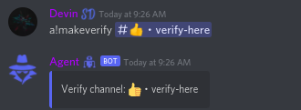

# Verification

Agent includes an easy to setup but advanced system to verify that you are here for the right uses.  Its set so everyone entering your server has to pass through it.\
\
Every user that joined your server (If enabled) will have to pass through the join gate. It helps insure that you are a real user not a scripted user. Upon join a user automatically receives the Unverified/Timeout role, to have this removed they will go to your verify channel and click verify. If there account is not marked as suspicious than they will pass, if it is they will stay locked out.

To enable/disable the join gate use `a!joingate enable` or `a!joingate disable`\

To set your verify channel use the command `a!makeverify #channel`

If setup correctly the bot will send a menu looking like this to that channel.\
.png>)
